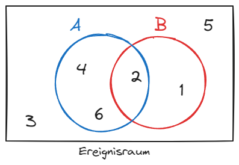
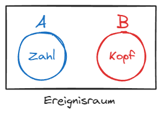
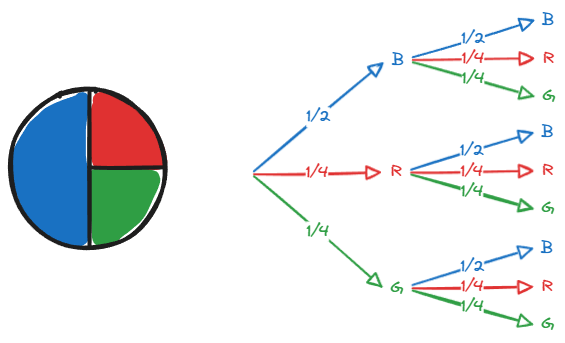
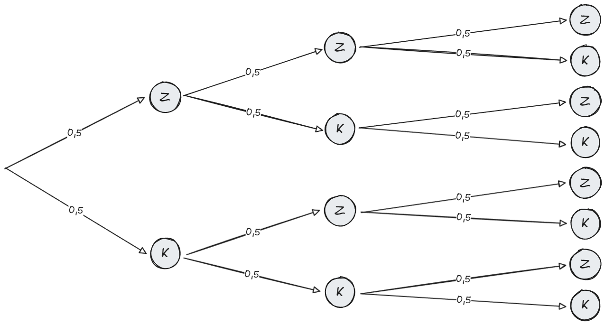
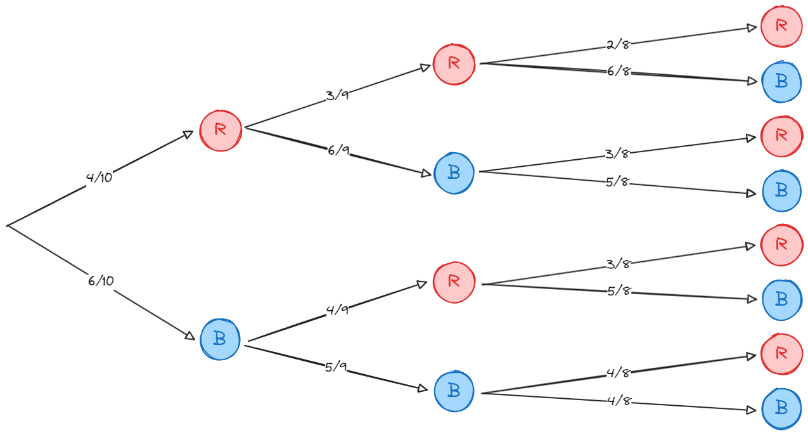
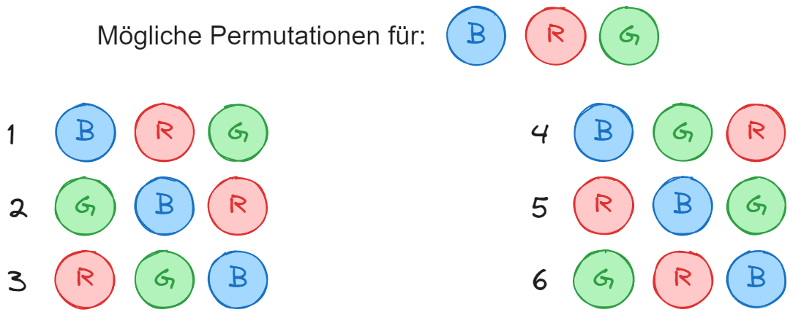
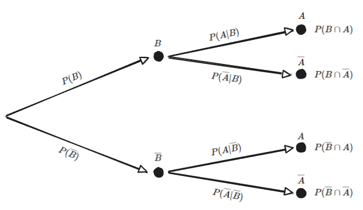

# Stochastik

## 1. Grundlagen

### Zufallsexperiment: Würfel

Ergebnisse: $E=\{1,2,3,4,5,6\}$

Ereignisse:

- A: `Die Augenzahl ist gerade` $A=\{2,4,6\}$
- B: `Die Augenzahl ist kleiner als 3` $B=\{1,2\}$

Mächtigkeit (auch: Kardinalität) der Menge: $|E|=6$

Beispiel: $P(A)=\frac{|A|}{|E|}=\frac{3}{6}=50\%$

Ereignisse verknüpfen:

$$(A\setminus B)\cup (B\setminus A)=\{1,4,6\}$$

Schnittmenge:

$$A\cap B=\{2\}$$

Vereinigungsmenge:

$$A\cup B=\{1,2,4,6\}$$

Komplement:

$$\overline{A}=\{1,3,5\}$$

Differenzmenge:

$$A\setminus B=\{4,6\}$$

### Komplementärregel

$$P(A)+P(B)=1$$

### Laplaceregel

Gilt für Experiment, wo jedes Ergebnis die gleiche Wahrscheinlichkeit hat, zum Beispiel ein Würfel.

$$P(A)=\frac{Anzahlder\space der\space zu\space A\space gehörenden\space Ergebnisse}{Anzahlder\space aller\space möglichen\space Ergebnisse}$$

Beispiel:

- A: `Es fällt eine 1,3,5 oder 6`
- B: `Es fällt eine ungerade Zahl`

$$P(A)=\frac{4}{6}$$

$$P(B)=\frac{3}{6}$$

---

## 2. Baumdiagramme

Pfad-Multiplikationsregel (entlang des Pfades):

$$P(B,R)=\frac{1}{2}\cdot\frac{1}{4}=\frac{1}{8}$$

_Erst blau dann rot._

Pfad-Additionsregel (mehrere Pfade):

$$P(E)=P(B,B)+P(G,B)=\frac{1}{2}\cdot\frac{1}{2}+\frac{1}{4}\cdot\frac{1}{2}=\frac{3}{8}$$

erst blau oder grün, dann blau

### Dreifacher Münzwurf

Ereignis:

"Bei dreifachem Münzwurf mindestens einmal Kopf"

Wahrscheinlichkeit:

$$P(E)=1-P(Z;Z;Z)=87,5\%$$

Merksatz:

> 'mindestens ein Mal' heißt Eins minus kein Mal.

---

## 3. Urnenmodell ohne Zurücklegen

Wichtig Hierbei ist, dass die Wahrscheinlichkeit sich nach jeder Ziehung ändert!

---

## 4. Kombinatorik

### Permutation

Eine **Permutation** ist eine Anordnung von Objekten in einer bestimmten Reihenfolge.

Formel:

$$n!$$

OHNE Zurücklegen und MIT Beachtung der Reihenfolge:

$$\frac{n!}{(n-k)!}$$

MIT Zurücklegen und MIT Beachtung der Reihenfolge:

$$n^k$$

OHNE Zurücklegen und OHNE Beachtung der Reihenfolge:

$$\frac{n!}{(n-k)!\cdot k!}=\binom{n}{k}$$

und

$$\binom{n}{k}=\binom{n}{n-k}$$

---

## 5. Bedingte Wahrscheinlichkeit

### Satz von Bayes

$$P(A|B)=\frac{P(B\cap A)}{P(B)}$$

Schreibweisen mit der gleichen Bedeutung:

$$P(A|B)=P_B(A)$$

gesprochen: Die Wahrscheinlichkeit von **A** unter der Bedingung, dass **B** bereits eingetroffen ist.

