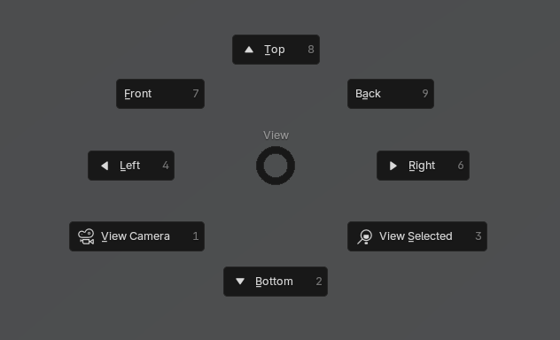

Hintergrundfarbe für Screenshot: `#7D7D7D`

## Navigation

Umsehen: ++mbutton++ + :material-mouse-scroll-wheel::material-cursor-move:

Zoom: `sroll wheel`

Verschieben: ++shift+mbutton++ + :material-mouse-scroll-wheel::material-cursor-move:

"Nach Hause" (alle Objekte in Szene anzeigen): ++home++ oder `View` `Frame all`

Pie Menu: View mit `Ö`

Aktive Kamera Perspektive toggeln: ++num0++

## Auswahl

++lbutton++ in Kombination mit ++shift++ **oder** ++ctrl++

Alles auswählen: ++a++
Alles abwählen: ++alt+a++

## Transformieren

Bewegen: ++g++ (grab)

Rotieren: ++r++

Skalieren: ++s++

Verlagsamen mit ++shift++ und schrittweise (snap) mit ++ctrl++

Tranformation zurücksetzen, jeweils ein ++alt++ davor.
