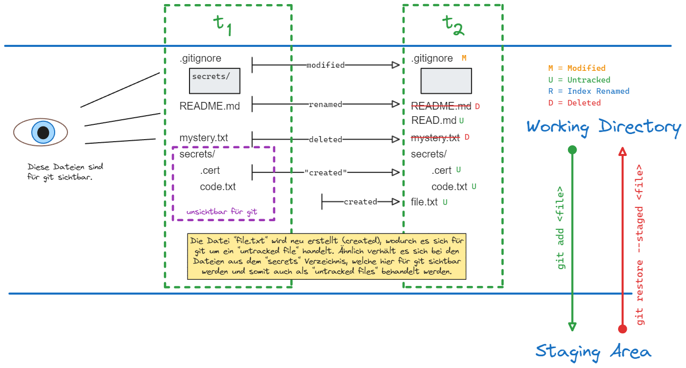

# Git

## Schaubild



## git status

Dieser Befehl zeigt alle Änderungen die von git festgestellt wurden.

**Syntax**:

```bash
git status
```

## git add

Fügt Dateien/Verzeichnis aus der **Working Directory** der **Staging Area** hinzu.

**Syntax**:

```bash
git add <file>
git add <folder>
```

!!! note "Alle Änderungen überführen"

    ```bash
    git add .
    ```

## git restore

Macht Änderungen im **Working Directory** rückgängig.

**Syntax**:

```bash
git restore <file>
```

## git restore --staged

entfernt eine Datei aus der **Staging Area**, sodass die Änderungen nur noch im **Working Directory** vorhanden sind.

**Syntax**:

```bash
git restore --staged <file>
```

`git restore --cached <file>` und `git restore --staged <file>` sind äquivalent.

## git rm & git mv

Statt der manuellen Verschiebung/Umbenennung (move) und Löschung (delete) von Dateien/Verzeichnissen empfiehlt sich die Verwendung von git. Dadurch werden Änderungen direkt in die Staging Area überführt und es ist kein `git add <file>` notwendig.
**Löschen**:

```bash
git rm <file>
```

**Verschieben/Umbenennen**:

```bash
git mv <file>
```


## git commit

Der Befehl speichert alles aus der **Staging Area** im lokalen Repository. Der Befehl `git commit` ruft den [[Setup, Konfiguration und Identität#^b9e4b1|core.editor]] auf, in welchem sich die Commit-Nachricht verfassen lässt. Ein Shortcut ist der Befehl:

```bash
git commit -m "<message>"
```

---

## Setup

Die Installation von git lässt sich mit dem folgenden Befehl leicht überprüfen.

```bash
git version
```

!!! tip "Tipp"

    `git --version` / `git -v` verwenden im Hintergrund den Befehl `git version`.

## Konfiguration

git wird über drei Dateien konfiguriert. Sind dieselben Einstellungen in mehreren Konfigurationsdateien enthalten, so überschreibt `.git/config` die Einstellungen aus `~/.gitconfig`, welche wiederum `[path]/etc/gitconfig` überschreibt.

Alle Konfigurationen anzeigen:

```bash
git config --list [--show-origin]
```

Eine Konfiguration auslesen:

```bash
git config --system core.editor
```

Eine Konfiguration setzen:

```bash
git config --system core.editor "nano"
```

### `[path]/etc/gitconfig`

_Einstellungen hier gelten für **alle Benutzer und alle Repositories auf dem System**._

```bash
git config --system [COMMAND]
```

!!! warning

    Hierfür werden Admin-Privilegien benötigt.

### `~/.gitconfig`

_Einstellungen hier gelten für einen **einzelnen Benutzer und seine Repositories**._

```bash
git config --global [COMMAND]
```

### `.git/config

_Einstellungen hier gelten für ein **einzelne Repository**._

```bash
git config --local [COMMAND]
```

## Identität

Der Name und die Email müssen gesetzt werden, dafür eignen sich die Flags `--system` oder auch `--global`, so müssen diese nur einmalig angelegt werden.

```bash
git config --global user.name "John Doe"
```

```bash
git config --global user.email "john.doe@example.com"
```
