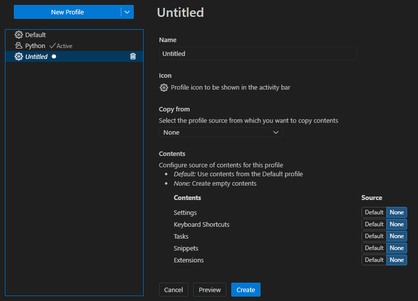
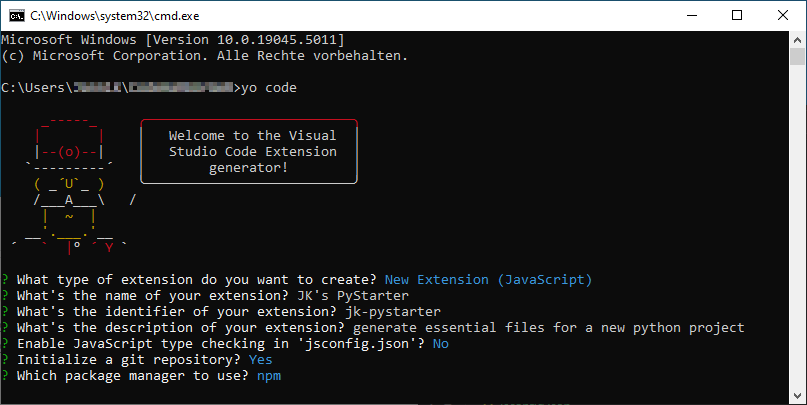
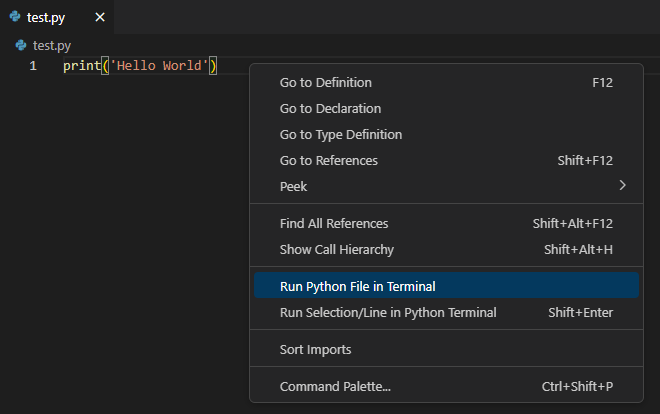
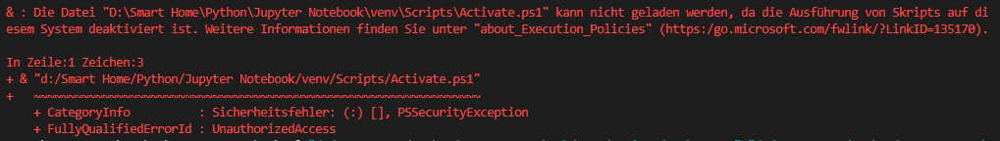
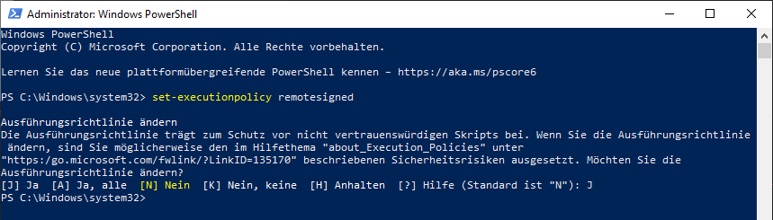
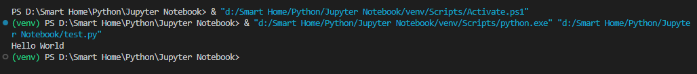

# VS Code

## Profile

Neues Profil über die Command Pallete erstellen:

```
Profiles: New Profile...
```



## Eigene Extension

Official Documentation: [https://code.visualstudio.com/api/get-started/your-first-extension](https://code.visualstudio.com/api/get-started/your-first-extension)

Prequirements:

- Node.js installed

Installation:

```bash
npm install --global yo generator-code
```

Create Code Base:

```bash
yo code
```

!!! note "Setup Konfiguration"

    

### Developing the extension

Inside the editor, open `extension.js` and press <kbd>F5</kbd> or run the command Debug: Start Debugging from the Command Palette (<kbd>Ctrl</kbd>+<kbd>Shift</kbd>+<kbd>P</kbd>). This will compile and run the extension in a new Extension Development Host window.

Run the Hello World command from the Command Palette (<kbd>Ctrl</kbd>+<kbd>Shift</kbd>+<kbd>P</kbd>) in the new window.

Now:

1. Change the code inside the `extension.js`
2. Run **Developer: Reload Window** in the new window.
3. Run your command (default: Hello World)

### Beispiel

```js title="extension.js"
const vscode = require('vscode');
const fs = require('fs');
const path = require('path');

/**
 * @param {vscode.ExtensionContext} context
 */
function activate(context) {
    // Command zur Erstellung der Template-Dateien registrieren
    let disposable = vscode.commands.registerCommand('pythonTemplate.createFiles', function () {
        // Hol den aktuellen Workspace-Ordner
        const workspaceFolders = vscode.workspace.workspaceFolders;
        if (!workspaceFolders) {
            vscode.window.showErrorMessage("Bitte öffne einen Ordner in VS Code, um das Template zu erstellen.");
            return;
        }

        // Der Pfad zum Workspace
        const rootPath = workspaceFolders[0].uri.fsPath;

        // Erstelle .gitignore, falls nicht vorhanden
        const gitignorePath = path.join(rootPath, '.gitignore');
        if (!fs.existsSync(gitignorePath)) {
            fs.writeFileSync(gitignorePath, 'venv/\n__pycache__/\n*.pyc\n');
        } else {
            vscode.window.showWarningMessage(".gitignore existiert bereits.");
        }

        // Erstelle README.md, falls nicht vorhanden
        const readmeTargetPath = path.join(rootPath, 'README.md');
        if (!fs.existsSync(readmeTargetPath)) {
            const readmeTemplatePath = path.join(context.extensionPath, 'README_template.md');
            let readmeContent = fs.readFileSync(readmeTemplatePath, 'utf-8');
            fs.writeFileSync(readmeTargetPath, readmeContent);
        } else {
            vscode.window.showWarningMessage("README.md existiert bereits.");
        }

        // vscode.window.showInformationMessage("Template Dateien wurden erstellt!");
    });

    context.subscriptions.push(disposable);
}

// This method is called when your extension is deactivated
function deactivate() {}

module.exports = {
    activate,
    deactivate
}
```

## Troubleshooting

### Verweigerung von Skript-Ausführung

=== "Fehler"

    
    

=== "Lösung"

    

    ```bash
    set-executionpolicy remotesigned
    ```

=== "Test"

    
